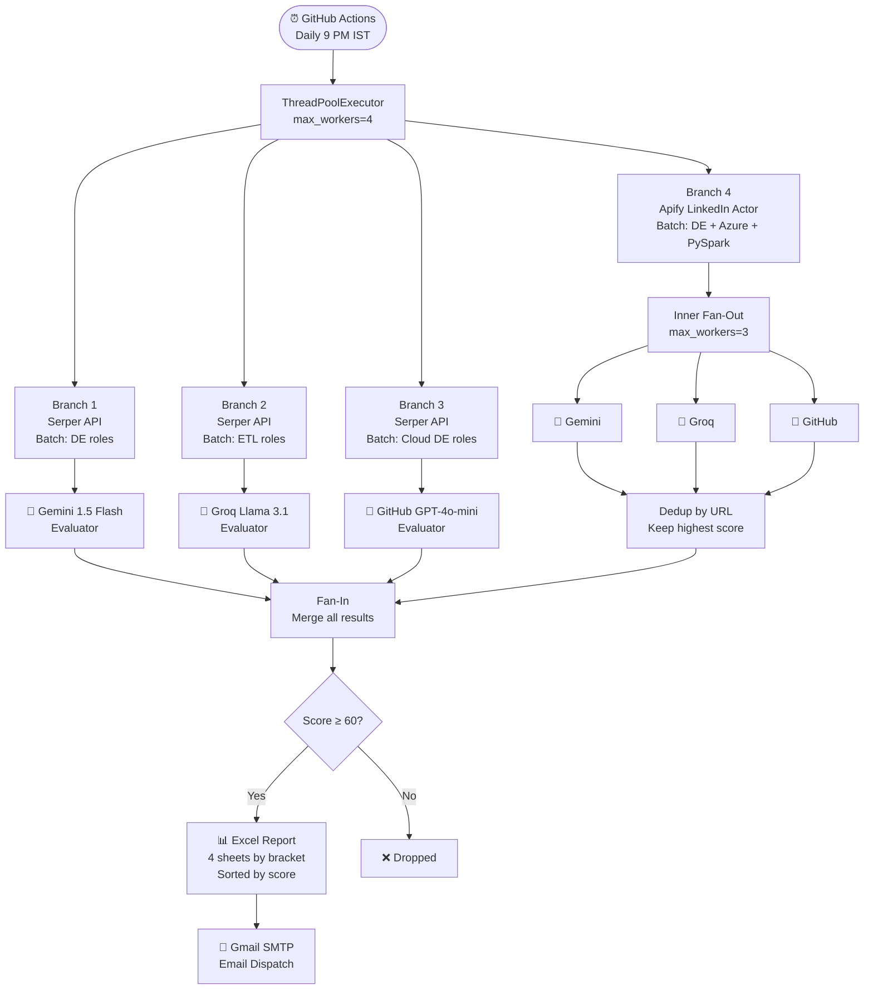

# 🤖 AI-Powered Job Hunter Pipeline

> An automated, multi-model data engineering pipeline that extracts, evaluates, and delivers daily job matches — built by a Data Engineer, for a Data Engineer.

[](https://github.com/your-username/job_automation_pipeline/actions/workflows/daily_job_search.yml)


---

## 📌 What It Does

Every day at **9:00 PM IST**, this pipeline automatically:

1. **Extracts** fresh job listings from Google Search (via Serper API) and LinkedIn (via Apify)
2. **Evaluates** each job using 3 LLMs in parallel against a detailed candidate profile
3. **Filters** jobs by experience bracket, recency, and resume match score (≥ 60)
4. **Delivers** a ranked Excel report to your inbox — organised by experience bracket, sorted by match score

---

## 🏗️ System Architecture

```
╔══════════════════════════════════════════════════════════════════════════════╗
║                     AI JOB HUNTER PIPELINE — OVERVIEW                      ║
╠══════════════════════════════════════════════════════════════════════════════╣
║                                                                              ║
║   TRIGGER: GitHub Actions Cron (Daily 9 PM IST) / Manual Dispatch           ║
║                                                                              ║
║   ┌─────────────────────────────────────────────────────────────────────┐   ║
║   │                        PHASE 1 — EXTRACTION                        │   ║
║   │                                                                     │   ║
║   │   ┌──────────────────────┐     ┌──────────────────────────────┐    │   ║
║   │   │   SERPER API         │     │   APIFY (LinkedIn Actor)     │    │   ║
║   │   │  Google Search Jobs  │     │  LinkedIn Jobs (no login)    │    │   ║
║   │   │                      │     │                              │    │   ║
║   │   │  Batch 1: DE roles   │     │  Batch 4: DE + Azure +       │    │   ║
║   │   │  Batch 2: ETL roles  │     │           PySpark roles      │    │   ║
║   │   │  Batch 3: Cloud DE   │     │  max_results=50 per role     │    │   ║
║   │   │  tbs=qdr:w (7 days)  │     │  datePosted="week"           │    │   ║
║   │   └──────────┬───────────┘     └──────────────┬───────────────┘    │   ║
║   │              │                                 │                    │   ║
║   │         Raw Job Dicts                    Raw Job Dicts              │   ║
║   │    {title, company, location,        {title, company, location,    │   ║
║   │     link, snippet}                    link, snippet, source}       │   ║
║   └──────────────┼─────────────────────────────────┼────────────────────┘   ║
║                  │                                 │                        ║
╠══════════════════╪═════════════════════════════════╪════════════════════════╣
║                  │                                 │                        ║
║   ┌──────────────▼─────────────────────────────────▼────────────────────┐  ║
║   │                      PHASE 2 — EVALUATION (Parallel)               │  ║
║   │                                                                     │  ║
║   │   SERPER JOBS → 3 dedicated branches (one model each)              │  ║
║   │   APIFY JOBS  → same 3 models simultaneously (inner fan-out)       │  ║
║   │                                                                     │  ║
║   │   ┌─────────────┐  ┌─────────────┐  ┌──────────────────────────┐  │  ║
║   │   │   BRANCH 1  │  │   BRANCH 2  │  │       BRANCH 3           │  │  ║
║   │   │   Serper    │  │   Serper    │  │       Serper             │  │  ║
║   │   │      +      │  │      +      │  │          +               │  │  ║
║   │   │   Gemini    │  │    Groq     │  │   GitHub (GPT-4o-mini)   │  │  ║
║   │   │  1.5 Flash  │  │ Llama 3.1  │  │                          │  │  ║
║   │   └──────┬──────┘  └──────┬──────┘  └────────────┬─────────────┘  │  ║
║   │          │                │                       │                │  ║
║   │   ┌──────▼────────────────▼───────────────────────▼─────────────┐  │  ║
║   │   │              BRANCH 4 — APIFY (LinkedIn)                    │  │  ║
║   │   │                                                              │  │  ║
║   │   │   LinkedIn Jobs ──► Gemini  ─┐                              │  │  ║
║   │   │   LinkedIn Jobs ──► Groq    ─┼──► Dedup by URL             │  │  ║
║   │   │   LinkedIn Jobs ──► GitHub  ─┘    (keep highest score)     │  │  ║
║   │   └──────────────────────────────────────────────────────────────┘  │  ║
║   │                                                                     │  ║
║   │   Each evaluator applies:                                           │  ║
║   │   ✓ Validity check  (aggregate page? stale? wrong experience?)      │  ║
║   │   ✓ Experience bracket  (0-1yr / 0-2yr / 1-2yr / Unknown)          │  ║
║   │   ✓ Resume match score  (0-100, rubric-based)                       │  ║
║   │   ✓ Skill extraction  (matched vs missing)                          │  ║
║   └─────────────────────────────────────────────────────────────────────┘  ║
║                                                                              ║
╠══════════════════════════════════════════════════════════════════════════════╣
║                                                                              ║
║   ┌─────────────────────────────────────────────────────────────────────┐   ║
║   │                       PHASE 3 — LOADER                             │   ║
║   │                                                                     │   ║
║   │   All qualified jobs (score ≥ 60) merged → deduplicated            │   ║
║   │                                                                     │   ║
║   │   Excel Report: data/Daily_Data_Engineering_Jobs.xlsx              │   ║
║   │   ┌────────────┬────────────┬────────────┬──────────┐              │   ║
║   │   │ 0 to 1 yrs │ 0 to 2 yrs │ 1 to 2 yrs │ Unknown  │  ← Sheets   │   ║
║   │   │  sorted ↓  │  sorted ↓  │  sorted ↓  │ sorted ↓ │  by score   │   ║
║   │   └────────────┴────────────┴────────────┴──────────┘              │   ║
║   │                                                                     │   ║
║   │   📧 Email dispatched via Gmail SMTP with Excel attached            │   ║
║   └─────────────────────────────────────────────────────────────────────┘   ║
║                                                                              ║
╚══════════════════════════════════════════════════════════════════════════════╝
```

---

## 🔀 Pipeline Flow (Mermaid)



---

## 📁 Project Structure

```
job_automation_pipeline/
│
├── src/
│   ├── extractor.py            # Serper API — Google Search job extraction
│   ├── extractor_apify.py      # Apify API — LinkedIn job extraction
│   ├── evaluator_gemini.py     # Google Gemini 1.5 Flash evaluator
│   ├── evaluator_groq.py       # Groq Llama 3.1 8b evaluator
│   ├── evaluator_github.py     # GitHub Models GPT-4o-mini evaluator
│   └── loader.py               # Excel writer + Gmail dispatcher
│
├── data/
│   └── Daily_Data_Engineering_Jobs.xlsx   # Generated output (gitignored)
│
├── .github/
│   └── workflows/
│       └── daily_job_search.yml           # GitHub Actions cron schedule
│
├── main.py                     # Orchestrator — fan-out / fan-in logic
├── requirements.txt
├── .env                        # Local secrets (gitignored)
└── README.md
```

---

## 🧠 Evaluation Rubric

Every job snippet is scored 0–100 by each LLM using an identical rubric:

| Criteria | Points |
|---|---|
| Core stack match (PySpark, Kafka, Airflow, ADF, ADLS) | +20 |
| SQL / Python explicitly required | +15 |
| Cloud platform match (Azure preferred, GCP acceptable) | +15 |
| BFSI / Banking / Fintech domain | +10 |
| ETL/ELT pipeline as core requirement | +10 |
| Streaming / real-time experience required | +10 |
| Orchestration tools match (Airflow, ADF) | +10 |
| Containerisation / DevOps mentioned | +5 |
| Data modelling / dbt / warehousing | +5 |
| **Deductions** | |
| Requires Hadoop / Hive / Scala / Java-only | -20 |
| Role is primarily Analyst / BI / Data Scientist | -15 |
| Requires 5+ years (even if "preferred") | -10 |

Jobs scoring **< 60 are dropped**. Jobs scoring **≥ 60 are qualified** and written to Excel.

---

## ⚙️ Setup & Installation

### Prerequisites
- Python 3.10+
- A Gmail account with [App Password](https://support.google.com/accounts/answer/185833) enabled

### 1. Clone & create virtual environment

```bash
git clone https://github.com/your-username/job_automation_pipeline.git
cd job_automation_pipeline
python -m venv venv

# Windows
venv\Scripts\activate

# Linux / macOS
source venv/bin/activate
```

### 2. Install dependencies

```bash
pip install -r requirements.txt
```

### 3. Configure `.env`

```bash
cp .env.example .env
```

Edit `.env`:

```env
# Extraction
SERPER_API_KEY=your_serper_key
APIFY_API_TOKEN=your_apify_token

# Evaluators
GEMINI_API_KEY=your_gemini_key
GROQ_API_KEY=your_groq_key
GH_MODELS_API_KEY=your_github_models_token

# Email dispatch
SENDER_EMAIL=your_gmail@gmail.com
SENDER_APP_PASSWORD=your_app_password
RECEIVER_EMAIL=recipient@gmail.com
```

### 4. Run locally

```bash
python main.py
```

---

## 🔑 API Keys — Where to Get Them

| Key | Provider | Free Tier |
|---|---|---|
| `SERPER_API_KEY` | [serper.dev](https://serper.dev) | 2,500 queries/month |
| `APIFY_API_TOKEN` | [console.apify.com](https://console.apify.com/settings/integrations) | $5 credits/month |
| `GEMINI_API_KEY` | [aistudio.google.com](https://aistudio.google.com/app/apikey) | 15 RPM free |
| `GROQ_API_KEY` | [console.groq.com](https://console.groq.com/keys) | Generous free tier |
| `GH_MODELS_API_KEY` | [github.com/settings/tokens](https://github.com/settings/tokens) | Free with GitHub account |

---

## 🚀 GitHub Actions — Automated Daily Run

The pipeline runs automatically at **9:00 PM IST (15:30 UTC)** via GitHub Actions.

### Required GitHub Secrets

Go to **Settings → Secrets and variables → Actions** and add:

```
SERPER_API_KEY
APIFY_API_TOKEN
GEMINI_API_KEY
GROQ_API_KEY
GH_MODELS_API_KEY
SENDER_EMAIL
SENDER_APP_PASSWORD
RECEIVER_EMAIL
```

### Manual Trigger

```bash
gh workflow run daily_job_search.yml
```

Or via GitHub UI: **Actions → Daily Job Search → Run workflow**

---

## 📊 Output — Excel Report

The generated Excel file has **4 sheets**, each sorted by `resume_match_score` descending:

| Sheet | Jobs in this bracket |
|---|---|
| `0 to 1 yrs` | Fresher / entry-level / trainee roles |
| `0 to 2 yrs` | Flexible range roles (best for current profile) |
| `1 to 2 yrs` | Roles requiring at least 1 year |
| `Unknown` | No experience requirement stated |

**Columns:** `source` · `evaluator` · `job_title` · `company_name` · `location` · `experience_bracket` · `resume_match_score` · `matched_skills` · `missing_skills` · `application_link`

---

## 🛠️ Tech Stack

| Layer | Technology |
|---|---|
| Language | Python 3.10 |
| Extraction — Search | Serper API (Google Search) |
| Extraction — LinkedIn | Apify LinkedIn Jobs Actor |
| Evaluation | Gemini 1.5 Flash · Groq Llama 3.1 · GPT-4o-mini |
| Orchestration (local) | `concurrent.futures.ThreadPoolExecutor` |
| Orchestration (cloud) | GitHub Actions (cron schedule) |
| Output | pandas · openpyxl (Excel) |
| Dispatch | Gmail SMTP |
| Secrets management | python-dotenv (local) · GitHub Secrets (CI) |

---

## 🗺️ Roadmap

- [ ] Add Airflow DAG for local orchestration
- [ ] PostgreSQL bronze/silver/gold layer storage
- [ ] Deduplication across Serper + Apify results globally
- [ ] Naukri.com scraper re-integration
- [ ] Telegram / Slack notification alongside email
- [ ] Dashboard (Streamlit) for historical match trends

---

## 👤 Author

**Sayan Sarkar** — Trainee Data Engineer @ Bitwise Solutions  
[LinkedIn](https://www.linkedin.com/in/sayan-sarkar-data-engineer/) · [GitHub](https://github.com/your-username)

---

> *Built as a portfolio project demonstrating real-world ETL pipeline design, multi-model LLM orchestration, and cloud automation.*
